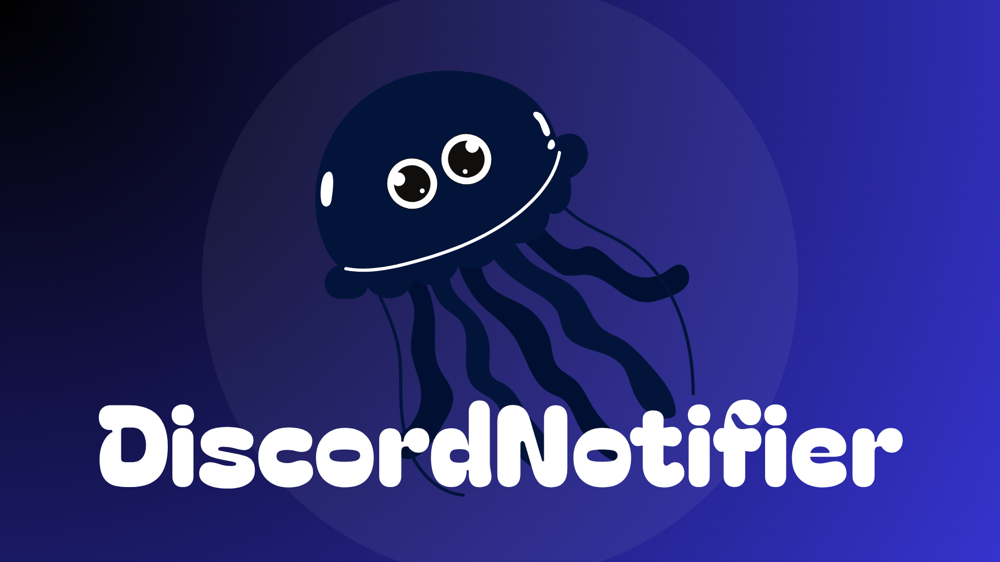
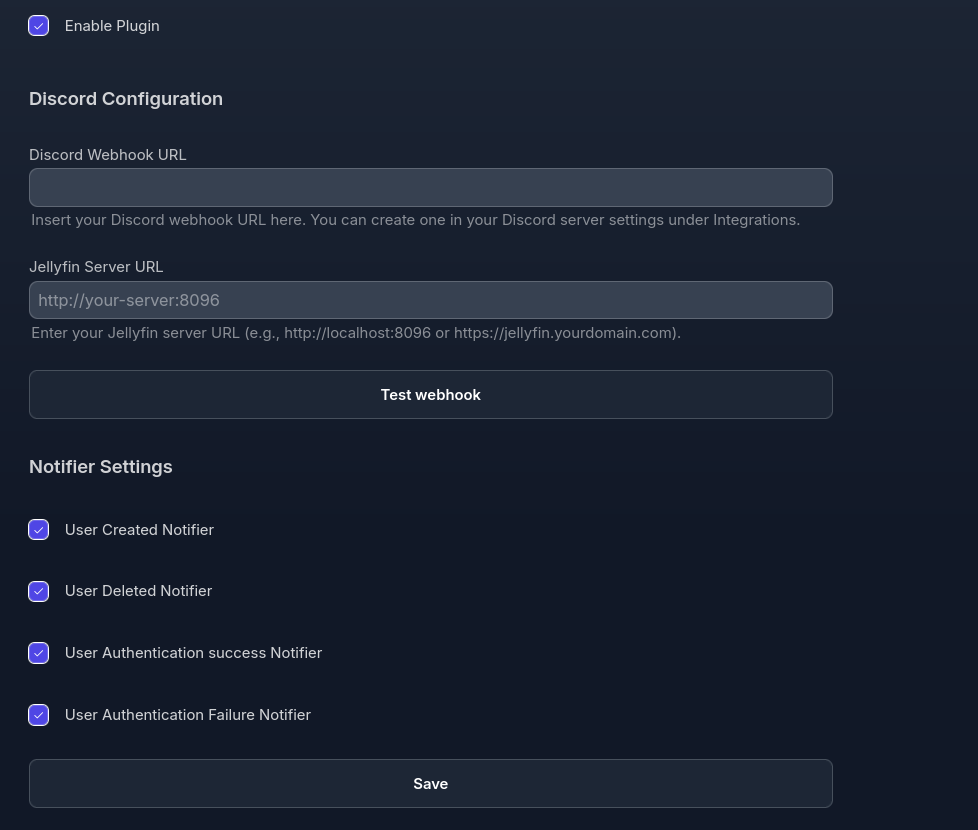

# jellyfin-plugin-DiscordNotifier

 Jellyfin media server plugin to easily send notifications on Discord server ! 



## About

This plugin allows you to send notifications to your Discord server when events occur on your Jellyfin media server. You can configure the notifications to be sent for various events such as new media added, media played, and more.

Current notifications (v1.7.0.0) :
 - UserCreated
 - UserDeleted
 - UserConnection
 - UserFailedConnection
 - ItemAdded
 - PlaybackStart — (with options)
 - PlaybackStop — (with options)

dotnet version : 9.0

## Installation

1. You have to open the dashboard of your Jellyfin server. Go to Catalog, click on ⚙️ button.
2. Click to + to add the URL.
```bash
https://raw.githubusercontent.com/cedev-1/Jellyfin-Plugin-DiscordNotifier/master/manifest.json
```
3. On the Catalog page click on Install.

## Plugin Configuration



## Development

I recommend using Nix with flakes for a reproducible development environment. You can use the provided `flake.nix` file to set up your development shell with all the necessary dependencies.

You can also use the `Taskfile.yml` to automate common tasks during the development process like building and run in a docker local jellyfin server.

For Task you can run  

```bash
task build
task clean
```

## TODO

The following features are planned.

### Notifications

- [ ] `UserLockedOut` — notify when an account is locked after too many failed attempts
- [ ] `UserUpdated` — notify when a user account is modified
- [ ] `UserPasswordChanged` — notify when a user changes their password
- [ ] `SessionStart` — notify when a new client session is opened (before playback)
- [ ] `PlaybackProgress` — notify at a defined interval during playback
- [ ] `ItemDeleted` — notify when media is removed from the library
- [ ] `TaskCompleted` — notify when a scheduled task finishes (library scan, backup, etc.)

---

> Want to contribute? Open an [issue](https://github.com/cedev-1/Jellyfin-Plugin-DiscordNotifier/issues) to discuss or submit a [PR](https://github.com/cedev-1/Jellyfin-Plugin-DiscordNotifier/pulls) directly.

## License

LICENSE [MIT](./LICENSE)
