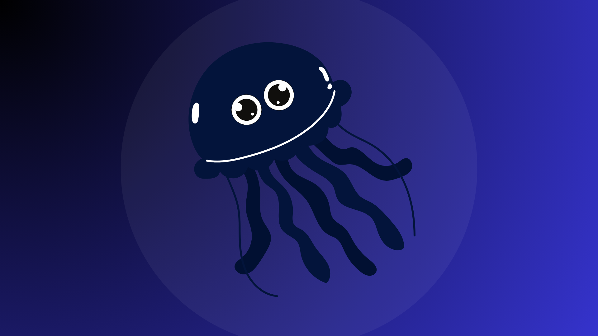

# jellyfin-plugin-DiscordNotifier

 Jellyfin media server plugin to easily send notifications on Discord server ! 



## About

This plugin allows you to send notifications to your Discord server when events occur on your Jellyfin media server. You can configure the notifications to be sent for various events such as new media added, media played, and more.

## Installation

1. You have to open the dashboard of your Jellyfin server. Go to Catalog, click on ⚙️ button.
2. Click to + to add the URL.
```bash
https://raw.githubusercontent.com/danielveigasilva/Jellyfin-Plugin-DiscordNotifier/master/manifest.json
```
