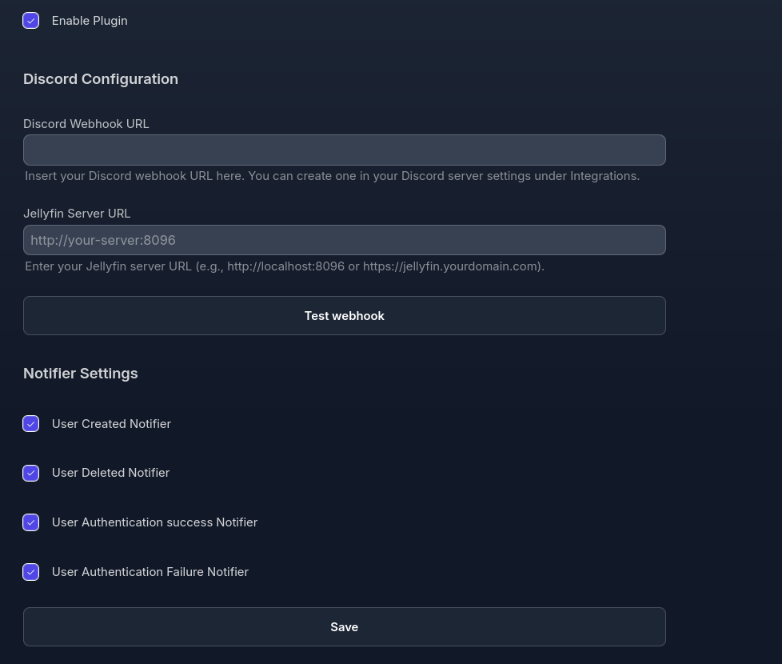

# jellyfin-plugin-DiscordNotifier

 Jellyfin media server plugin to easily send notifications on Discord server ! 


## About

This plugin allows you to send notifications to your Discord server when events occur on your Jellyfin media server. You can configure the notifications to be sent for various events such as new media added, media played, and more.

For the moment, I have only developed the notifications (v1.5.0.0) :
 - UserCreated
 - UserDeleted
 - UserConnection
 - UserFailedConnection

## Installation

1. You have to open the dashboard of your Jellyfin server. Go to Catalog, click on ⚙️ button.
2. Click to + to add the URL.
```bash
https://raw.githubusercontent.com/cedev-1/Jellyfin-Plugin-DiscordNotifier/master/manifest.json
```
3. On the Catalog page click on Install.

## Plugin Configuration



## Development

I recommend using Nix with flakes for a reproducible development environment. You can use the provided `flake.nix` file to set up your development shell with all the necessary dependencies.

You can also use the `Taskfile.yml` to automate common tasks during the development process like building and run in a docker local jellyfin server.

For Task you can run  

```bash
task build
task clean
```


